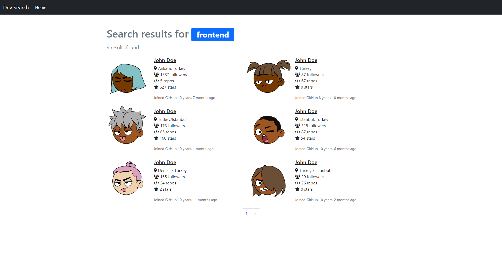
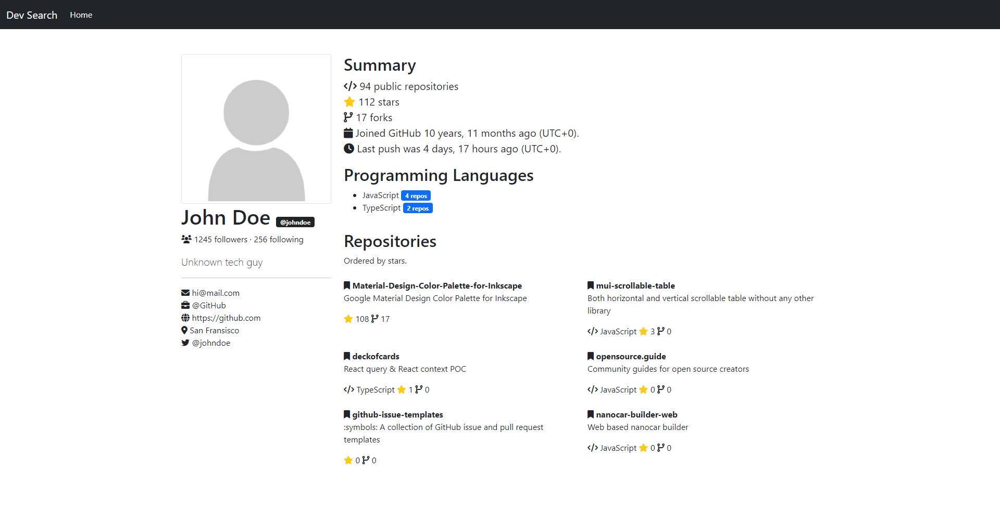

# GitHub Developer Search
It allows you to search for developers on GitHub and provides statistics about their GitHub profiles.

## Installing
- Run `pip install -r requirements.txt`
- It runs with PostgreSQL by default but you can change it on `backend/settings.py`
- It can run without GitHub access token but if you specify GitHub username and personal access token in `devsearch/settings.py` you will get higher rate limit.

## Running
- Run `python manage.py runserver`
- Open http://localhost:8000/

## Preview

*Home Page*

*Search Results*

*Profile Detail Page*

## Credits
- [Django](https://github.com/django/django)
- [Bootstrap](https://github.com/twbs/bootstrap)